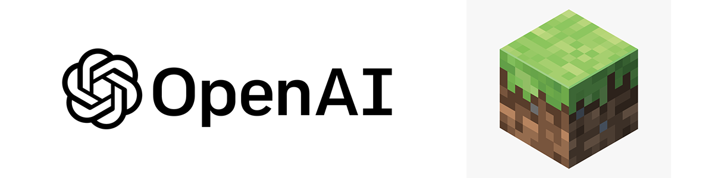

# [MineGPT](https://github.com/JohnKearney1/MineGPT)
[](https://github.com/JohnKearney1/MineGPT/issues)
[](https://github.com/JohnKearney1/MineGPT/issues?q=is%3Aissue+is%3Aclosed)
[](https://github.com/JohnKearney1/MineGPT/stargazers)
[](https://github.com/JohnKearney1/MineGPT/network/members)
[]()
[](https://www.redhat.com/en/topics/open-source/what-is-open-source)
[](https://github.com/JohnKearney1/MineGPT/graphs/contributors)
[](https://github.com/JohnKearney1/MineGPT/activity)



MineGPT is a minecraft bot that responds to chat messages using the ChatGPT API. It supports a variety of commands, pre-made characters, helpful behaviors, and more!

All chats sent in the game that are **not** commands are sent to ChatGPT for a response. The response is printed in game & the chat is recorded in the console.

## How to use

1. Install node.
2. Navigate to the MineGPT directory in your command prompt, terminal or IDE.
3. Install the dependencies: `npm install`
4. Configure your account info: in *`.env`* Add the server ip, account information, and openAI API key. (More info below!)
5. Run the bot: `node MineGPT.js`

## Default Behaviors
The bot has only a few continuous behaviors:

1. If there is a player nearby, MineGPT will look at them.
2. If the bot has bread, it will auto-eat it when hungry.
3. MineGPT will auto-respawn when it dies.
4. MineGPT will attempt to re-connect to the server if it is disconnected.

All other behaviors are triggered by commands or chat messages.

## Commands

All commands are sent as ingame chats to the bot, and override the ChatGPT functionality to preform some other task. All commands begin with the prefix `!`.
```
- !help -> Shows a list of commands

- !follow -> Toggles following the nearest entity on and off
- !follow <stop> -> Force stops following all entities
- !follow <player> <username> -> Follows the specified player until stopped

- !goto <x> <y> <z> -> Goes to the specified coordinates
- !goto <username> -> Goes to the specified player

- !sleep -> Locates the nearest bed, goes to it, and sleeps
- !wake -> Wakes the bot from it's sleep

- !equip <item>? -> Equips the specified item, or next item if no item is specified
- !drop <item>? -> Drops the specified item, or next item if no item is specified

- !ask <question> -> Asks the bot a question (alias command for ordinary chat)
- !newchat -> Wipes the chat history and starts a new conversation
- !togglechat -> Toggles ChatGPT off and on. Does not send requests to GPT when off.

- !prompt <character> -> Sets the character to use for the next conversation
- Characters: pirate, doctor, cowboy, robot, alien, lore

```

## Setting up the `.env` (Your Account Info)

The default .env looks like this:

```
MINEGPT_HOST=localhost
MINEGPT_PORT=25565
MINEGPT_VERSION=1.20.1
MINEGPT_AUTH=microsoft
MINEGPT_USERNAME=example@example.com
MINEGPT_PASSWORD=password123
MINEGPT_OPENAI_API_KEY=sk-000000000000000000000000000000000000000
```
- Host: The IP address of the server to connect to (or localhost) without the port number  
- Port: The port your server is running on. 25565 is the default.
- Version: The version of Minecraft your server is running. 1.20.1 is the default.
- Auth: `minecraft` or `mojang` depending on how you login to your account. (mojang is depreciated)  
- Username: The email or username you use to login to your Minecraft Account
- Password: The password you use to login to your Minecraft Account
- OpenAI: Your OpenAI API key. You can obtain one from [platform.openai.com](https://platform.openai.com/account/api-keys).

## Disclaimer
MineGPT is not affiliated with Mojang, Microsoft, or OpenAI. It is an open source project that uses their services. You are responsible for how you use it. Please use responsibly.

This project is created with [mineflayer](https://github.com/PrismarineJS/mineflayer)!